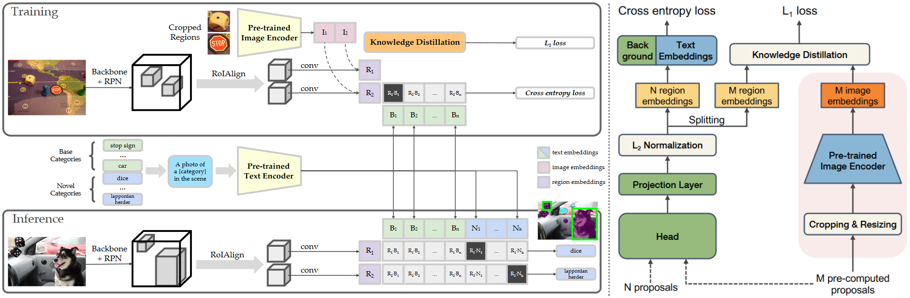

# [Oriented ViLD] Open-Vocabulary Detection via Vision and Language Knowledge Distillation

- [Open-Vocabulary Detection via Vision and Language Knowledge Distillation](https://arxiv.org/abs/2104.13921)

## Introduction

Open-vocabulary object detection detects objects described by arbitrary text inputs. The fundamental challenge is the availability of training data. Existing object detection datasets only contain hundreds of categories, and it is costly to scale further. To overcome this challenge, we propose ViLD. Our method distills the knowledge from a pretrained open-vocabulary image classification model (teacher) into a two-stage detector (student). Specifically, we use the teacher model to encode category texts and image regions of object proposals. Then we train a student detector, whose region embeddings of detected boxes are aligned with the text and image embeddings inferred by the teacher.




Here is the implemetation of **Oriented ViLD**.


## Quick Start:

```shell
bash projects/ViLD/run.sh
```


## Training

1. train base detector
```shell
exp1="oriented-rcnn_r50-fpn_20k_visdronezsd_base-set"
python tools/train.py \
    projects/ViLD/configs/$exp1.py
```

2. merge weights

```shell
python projects/CastDetv2/tools/merge_weights.py \
    --clip_path checkpoints/RemoteCLIP-RN50.pt \
    --base_path work_dirs/$exp1/iter_20000.pth \
    --save_path work_dirs/$exp1/merged_vild_init_iter20k.pth
    --target_model vild
```

3. prepare pseudo labels

```shell
exp2="vild_oriented-rcnn_r50_fpn_visdronezsd_step1_prepare"
python tools/test.py \
    projects/ViLD/configs/$exp2.py \
    work_dirs/$exp1/merged_vild_init_iter20k.pth
```

4. self-training

```shell
exp3="vild_oriented-rcnn_r50_fpn_visdronezsd_step2_finetune"
python tools/train.py \
    projects/ViLD/configs/$exp3.py
```


## Evaluation

```shell
python tools/test.py \
    projects/ViLD/configs/$exp3.py \
    work_dirs/$exp3/iter_10000.pth \
    --work-dir work_dirs/$exp3/dior_test
```


## Acknowledgement

Thanks the wonderful open source projects [MMRotate](https://github.com/open-mmlab/mmrotate) and [ViLD](https://github.com/tensorflow/tpu/tree/master/models/official/detection/projects/vild)!


## Citation

```
// Oriented ViLD (this repo)
@misc{li2024exploitingunlabeleddatamultiple,
      title={Exploiting Unlabeled Data with Multiple Expert Teachers for Open Vocabulary Aerial Object Detection and Its Orientation Adaptation}, 
      author={Yan Li and Weiwei Guo and Xue Yang and Ning Liao and Shaofeng Zhang and Yi Yu and Wenxian Yu and Junchi Yan},
      year={2024},
      eprint={2411.02057},
      archivePrefix={arXiv},
      primaryClass={cs.CV},
      url={https://arxiv.org/abs/2411.02057}, 
}

// ViLD (Horizontal detection)
@article{gu2021open,
  title={Open-vocabulary object detection via vision and language knowledge distillation},
  author={Gu, Xiuye and Lin, Tsung-Yi and Kuo, Weicheng and Cui, Yin},
  journal={arXiv preprint arXiv:2104.13921},
  year={2021}
}
```

